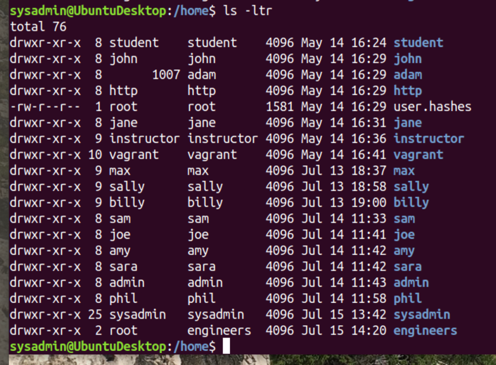
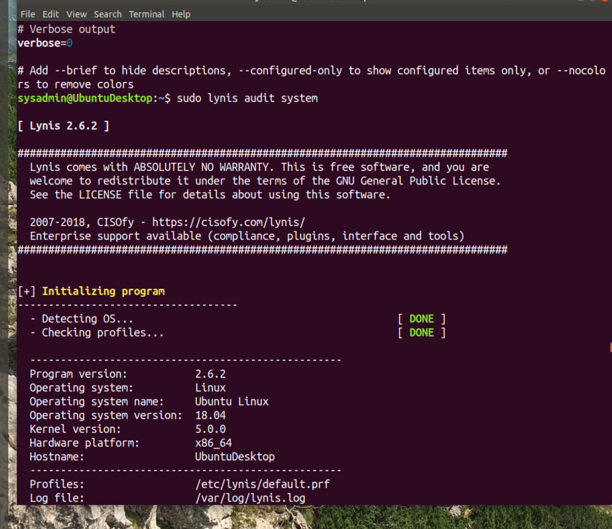
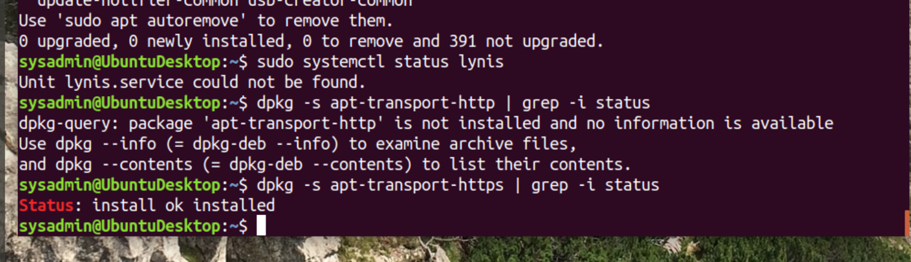
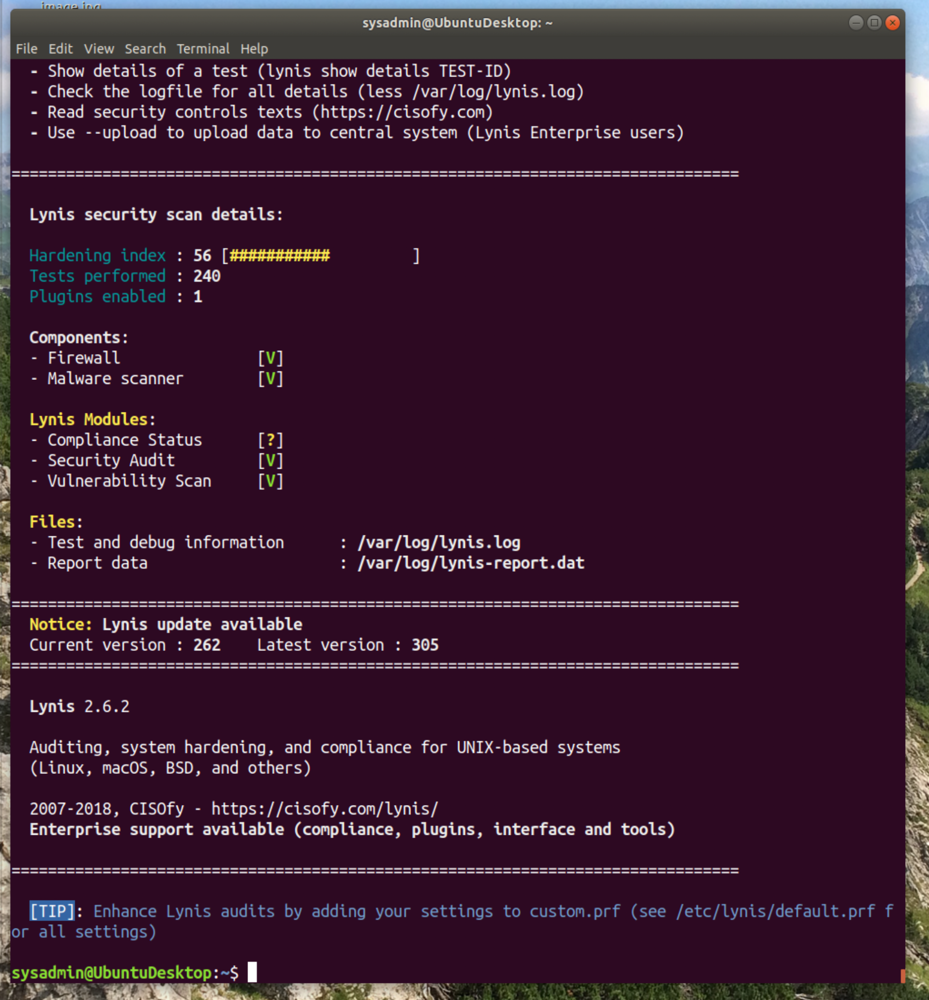
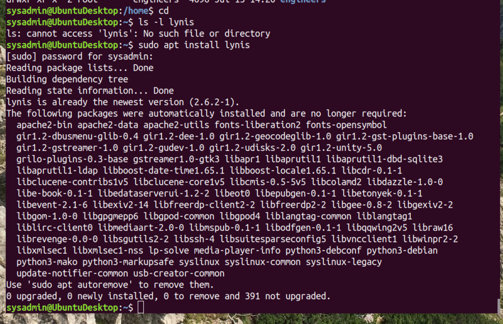

## Week 4 Homework Submission File: Linux Systems Administration

### Step 1: Ensure/Double Check Permissions on Sensitive Files

1. Permissions on `/etc/shadow` should allow only `root` read and write access.

    - Command to inspect permissions: sudo ls -l /etc/shadow

    - Command to set permissions (if needed): sudo chmod 600 /etc/shadow
                                              
                                              
                                              

2. Permissions on `/etc/gshadow` should allow only `root` read and write access.

    - Command to inspect permissions: sudo ls -l /etc/gshadow

    - Command to set permissions (if needed): sudo chmod 600 /etc/gshadow

3. Permissions on `/etc/group` should allow `root` read and write access, and allow everyone else read access only.

    - Command to inspect permissions: sudo ls -l /etc/group

    - Command to set permissions (if needed): Not needed. but if so sudo chmod 644 /etc/group

4. Permissions on `/etc/passwd` should allow `root` read and write access, and allow everyone else read access only.

    - Command to inspect permissions: sudo ls -l /etc/passwd

    - Command to set permissions (if needed):Not needed but if so. sudo chmod 644 /etc/passwd

### Step 2: Create User Accounts

1. Add user accounts for `sam`, `joe`, `amy`, `sara`, and `admin`.

    - Command to add each user account (include all five users): sudo adduser sam 
                                                                 sudo adduser joe
                                                                 sudo adduser amy
                                                                 sudo adduser sara
                                                                 sudo adduser admin

2. Ensure that only the `admin` has general sudo access.

    - Command to add `admin` to the `sudo` group: sudo usermod -aG sudo admin

### Step 3: Create User Group and Collaborative Folder

1. Add an `engineers` group to the system.

    - Command to add group: sudo addgroup engineers

2. Add users `sam`, `joe`, `amy`, and `sara` to the managed group.

    - Command to add users to `engineers` group (include all four users):
    sudo usermod -G engineers sam
    sudo usermod -G engineers amy
    sudo usermod -G engineers joe
    sudo usermod -G engineers sara

3. Create a shared folder for this group at `/home/engineers`.

    - Command to create the shared folder: sudo mkdir /home/engineers

4. Change ownership on the new engineers' shared folder to the `engineers` group.

    - Command to change ownership of engineer's shared folder to engineer group: sudo chown :engineers engineers
    

### Step 4: Lynis Auditing

1. Command to install Lynis: sudo apt install lynis

2. Command to see documentation and instructions: man lynis

3. Command to run an audit: sudo lynis audit system

4. Provide a report from the Lynis output on what can be done to harden the system. 
Updating the system are just a few to begin with. Maybe use some external storage. 
    - Screenshot of report output: See screen shots...

### Bonus
1. Command to install chkrootkit: sudo apt-get chkrootkit

2. Command to see documentation and instructions: man chkrootkit

3. Command to run expert mode: sudo chkrootkit -x  well that was cool.

4. Provide a report from the chrootkit output on what can be done to harden the system.
Removing a lot of un wanted applications.Updating the system are just a few to begin with. Maybe use some external storage. 
    - Screenshot of end of sample output: See screen shots ...
    
    

---
© 2020 Trilogy Education Services, a 2U, Inc. brand. All Rights Reserved.
