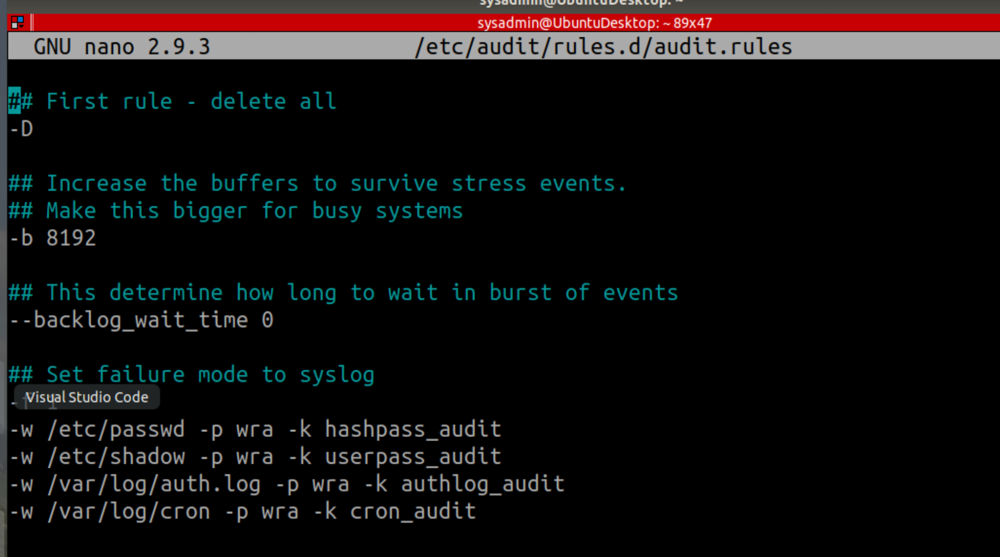

## Week 5 Homework Submission File: Archiving and Logging Data

Please edit this file by adding the solution commands on the line below the prompt.

Save and submit the completed file for your homework submission.

---

### Step 1: Create, Extract, Compress, and Manage tar Backup Archives

1. Command to **extract** the `TarDocs.tar` archive to the current directory: tar -xvvf TarDocs.tar 
<!--- --->


2. Command to **create** the `Javaless_Doc.tar` archive from the `TarDocs/` directory, while excluding the `TarDocs/Documents/Java` directory:sudo tar -cvvf Javaless_Doc.tar --exclude='TarDocs/Documents/Java' TarDocs
( Important isuue is that we use relative path not absolute, and use the single quotes dam it!!! I ran this 40 times until it finally worked without cheating and deleting files via interface:))
<!---  --->


3. Command to ensure `Java/` is not in the new `Javaless_Docs.tar` archive: tar tvvf Javaless_Doc.tar | grep Java


**Bonus** 
- Command to create an incremental archive called `logs_backup_tar.gz` with only changed files to `snapshot.file` for the `/var/log` directory:
sudo tar --listed-incremental=snapshot.file -cvzf logs_backup.tar.gz /var/log
#### Critical Analysis Question

- Why wouldn't you use the options `-x` and `-c` at the same time with `tar`?
You may not want to extract and create at the same time. -c creates a new archive and -x will extract files. I really don't think you should extract and create at the same time period. 
---

### Step 2: Create, Manage, and Automate Cron Jobs

1. Cron job for backing up the `/var/log/auth.log` file:
I ran the code below to test my theory. I wanted to make sure that it created the file in the designated location at the time I specified. AND IT DID!!!
The screen shot is my result for my test of the job.
<br>
33 10 * * 5 tar -czf /home/sysadmin/Projects/auth_backup.tgz /var/log/auth.log
<br>
This is the code for the assignment below.
<br>
0 6 * * 3 tar -czf /home/sysadmin/Projects/auth_backup.tgz /var/log/auth.log
<!---  -->

---

### Step 3: Write Basic Bash Scripts

1. Brace expansion command to create the four subdirectories:
    sysadmin@UbuntuDesktop:~$ mkdir ~/backups/{freemem,diskuse,openlist,freedisk}
    <!--  -->

2. Paste your `system.sh` script edits below:

    ```bash
    #!/bin/bash
    [Your solution script contents here]


    #!/bin/bash

# INSTRUCTIONS: Edit the following placeholder command a$
# For example: cpu_usage_tool > ~/backups/cpuuse/cpu_usa$
# The cpu_usage_tool is the command and ~/backups/cpuuse$
# In the above example, the `cpu_usage_tool` command wil$
# Do not forget to use the -h option for free memory, di$


# Free memory output to a free_mem.txt file


free -dh >> ~/backups/freemem/free_mem.txt

# Disk usage output to a disk_usage.txt file

 
du -sh >> ~/backups/diskuse/disk_usage.txt

# List open files to a open_list.txt file

 
lsof -h >> ~/backups/openlist/open_list.txt

# Free disk space to a free_disk.txt file


df -h >> ~/backups/freedisk/free_disk.txt
    ```


<!--  -->


Optional:

<!--  -->


3. Command to make the `system.sh` script executable:
    sudo chmod +x system.sh

**Optional**
- Commands to test the script and confirm its execution:
    sudo ls -l system.sh

**Bonus**
- Command to copy `system` to system-wide cron directory:

---

### Step 4. Manage Log File Sizes
 
1. Run `sudo nano /etc/logrotate.conf` to edit the `logrotate` configuration file. 

    Configure a log rotation scheme that backs up authentication messages to the `/var/log/auth.log`.

    - Add your config file edits below:

    ```bash
    [Your logrotate scheme edits here]
    /var/log/auth.log {
    missingok
    weekly
    delaycompress
    compress
    rotate 7
    notifempty
    endscript
}
    

    ```
---

### Bonus: Check for Policy and File Violations

1. Command to verify `auditd` is active:
    systemctl status auditd 

2. Command to set number of retained logs and maximum log file size:

    - Add the edits made to the configuration file below:
    sudo nano /etc/audit/auditd.conf

    ```bash
    [Your solution edits here]
    max_log_file = 35
    num_logs = 7

    ```

3. Command using `auditd` to set rules for `/etc/shadow`, `/etc/passwd` and `/var/log/auth.log`:


    - Add the edits made to the `rules` file below:

    ```bash
    [Your solution edits here]
    -w /etc/passwd -p wra -k hashpass_audit
    -w /etc/shadow -p wra -k userpass_audit
    -w /var/log/auth.log -p wra -k authlog_audit
    ```

     <!--  


4. Command to restart `auditd`:
   sudo systemctl restart auditd

   


5. Command to list all `auditd` rules:
   sudo auditctl -l

6. Command to produce an audit report:
   sudo aureport -au

   <!-- 


7. Create a user with `sudo useradd attacker` and produce an audit report that lists account modifications:
   sudo useradd attacker

   <!-- 


8. Command to use `auditd` to watch `/var/log/cron`:

 <!--  -->



9. Command to verify `auditd` rules:

<!--  -->


---

### Bonus (Research Activity): Perform Various Log Filtering Techniques

1. Command to return `journalctl` messages with priorities from emergency to error:
journalctl -p "emerg"   
journalctl -p "alert"
journalctl -p "crit"
journalctl -p "err"

1. Command to check the disk usage of the system journal unit since the most recent boot:
sudo journalctl --disk-usage

1. Comand to remove all archived journal files except the most recent two:
sudo journalctl --vacuum-file=2
Now I really have to head up stairs and do the vacuuming lol.

<!--  -->


1. Command to filter all log messages with priority levels between zero and two, and save output to `/home/sysadmin/Priority_High.txt`:
sudo journalctl -p 0 >> /home/sysadmin/Priority_High.txt
sudo journalctl -p 1 >> /home/sysadmin/Priority_High.txt
sudo journalctl -p 2 >> /home/sysadmin/Priority_High.txt


1. Command to automate the last command in a daily cronjob. Add the edits made to the crontab file below:

    ```bash
    [Your solution cron edits here]
    0 6 * * *  journalctl -p 0 >> /home/sysadmin/Priority_High.txt
    0 6 * * *  journalctl -p 1 >> /home/sysadmin/Priority_High.txt
    0 6 * * *  journalctl -p 2 >> /home/sysadmin/Priority_High.txt

    ```

    <!-- 


---
© 2020 Trilogy Education Services, a 2U, Inc. brand. All Rights Reserved.
